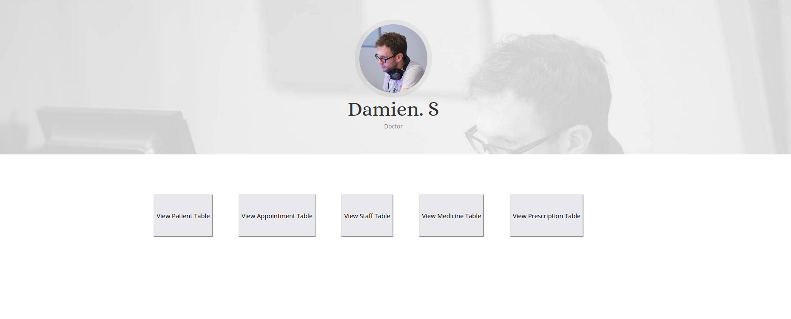
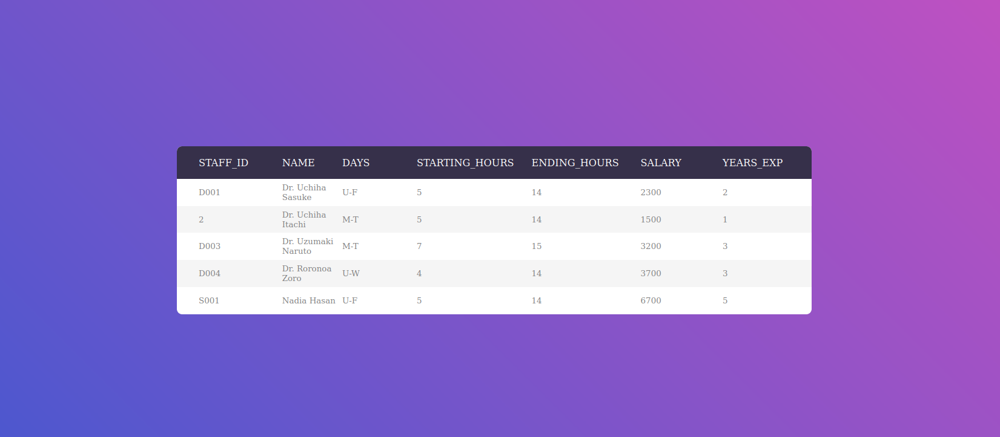
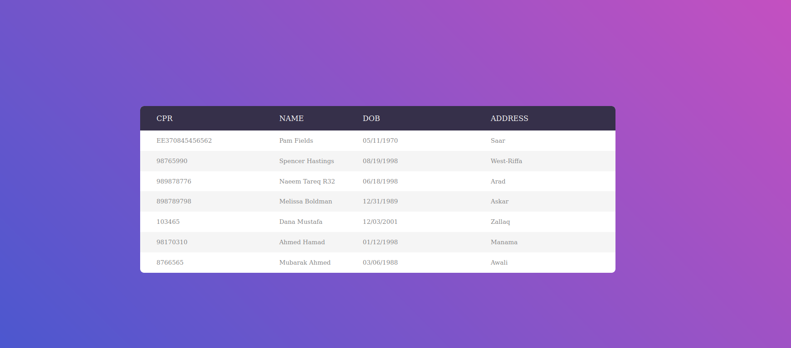

# Healing Clinic
A Website that was created in order to demonstrate how Database Management System([DBMS](https://en.wikipedia.org/wiki/Database#Database_management_system)) works.

Healing Clinic website solves a lot of problems, such as a great alternative to a traditional filling system. Relying on [SQL](https://en.wikipedia.org/wiki/SQL) database can have many benefits, such as security, backup, ease of use, etc.

This project was made by a team of students from **University of Bahrain(UOB)** as class assignment.

We have also integrated **Facial Recognition** login system for the Admin, in order to improve security. 

We have scored **18.5 out of 20** for this project.

  

# Design
Have a look on the screenshots below.

##### Login Page

 
 

##### Dashboard Page

 
 

##### Table Page

 
 

##### Table Page

